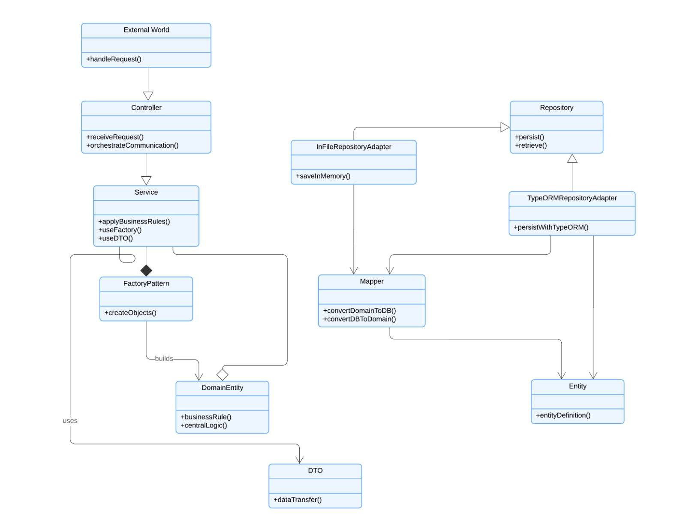

# 😸 MiAuDote - API para Gerenciamento de Abrigo de Animais 🐶

## Descrição

**MiAuDote** é uma api desenvolvida como trabalho de conclusão do curso de Imersão a JavaScript e Nuvem AWS do {Reprograma}, com o objetivo de ajudar abrigos de animais a gerenciar de forma eficiente suas operações diárias. O sistema facilita o cadastro e acompanhamento dos animais, o controle de adoções, além de oferecer funcionalidades para o controle financeiro e a geração de relatórios. Este projeto busca contribuir para a causa social de proteção e cuidado dos animais, garantindo que eles recebam a atenção necessária até serem adotados.

## Motivação
A motivação para a criação do **MiAuDote** veio da vontade de contribuir para a causa animal. A gestão de abrigos de animais é muitas vezes complexa e manual, o que pode resultar em falta de organização e eficiência. Este software visa oferecer uma solução prática para que abrigos possam focar no cuidado dos animais enquanto o sistema facilita a parte administrativa. Além disso, o MiAuDote promove a transparência no controle financeiro e no processo de adoção.

## Características Principais

- **Cadastro e Gerenciamento de Animais**: Registro completo de informações sobre os animais do abrigo, incluindo nome, espécie, idade, vacinas, status de adoção e condições pós-cirúrgicas.
- **Registro de Adoções**: Associar adotantes aos animais, controlando o processo de adoção.
- **Controle Financeiro**: Registra despesas como alimentação, vacinas, castrações e outros tipos de gastos. Permite também o controle de doações e o valor estimado dos itens recebidos.
- **Cadastro de Pessoas**: Entidade centralizada para gerenciar dados de adotantes, veterinários, doadores e voluntários.

## Arquitetura

## Documentação
Toda a documentação detalhada está disponível na [pasta de documentação do repositório](https://github.com/anacarolinast/ON36-IJS-MiAuDote/tree/main/docs).
Para testes e visualização do funcionamento dos endpoints, basta acessar o [swagger da api](http://54.208.10.249:3000/docs)

## Sobre as desenvolvedoras

## 💗 Ana Carolina Santos

Graduanda em Análise e Desenvolvimento de Sistemas, atuo como pesquisadora científica e desenvolvedora full-stack.

- 💌 Email: anna1100st@gmail.com
- 👩🏻‍💻 GitHub: anacarolinast

## 💗 Maria Luiza Mourão

Engenheira eletricista e técnica em Eletrônica, em transição de carreira. Apaixonada por gatos, colaborei com este projeto sabendo da importância de transformar a vida de animais de rua, oferecendo a eles uma nova chance de encontrar um lar.
- 💌 Email: marialuizasm.97@gmail.com
- 💼 LinkedIn: in/maria-luiza-mourao
- 👩🏻‍💻 Github: mlsmourao
